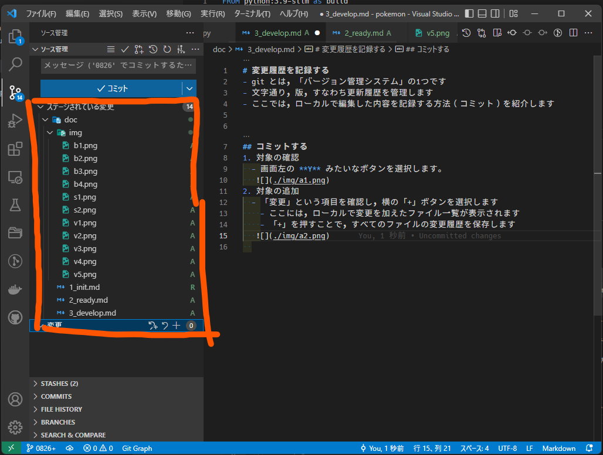

# 変更履歴を記録する
- git とは，「バージョン管理システム」の1つです
- 文字通り，版，すなわち更新履歴を管理します
- ここでは，ローカルで編集した内容を記録する方法（コミット）を紹介します

## コミットする
1. 対象の確認
  - 画面左の **Y** みたいなボタンを選択します。
   
2. 対象の追加
  - 「変更」という項目を確認し，横の「+」ボタンを選択します
    - ここには，ローカルで変更を加えたファイル一覧が表示されます
    - 「+」を押すことで，すべてのファイルの変更履歴を保存します
   
3. 対象の準備
  - すべてのファイルが「ステージされている変更」にあることを確認してください
   
4. コミットメッセージ
  - 「メッセージ」に作業内容などを記入します
    - ここに変更点や作業内容を残すことで，振り返りやすくします
    - 「コミットメッセージ」と呼ばれます
  
5. 同期
  - 「変更の同期」をクリックします
    - ローカルの変更を Github に送信します
   

  